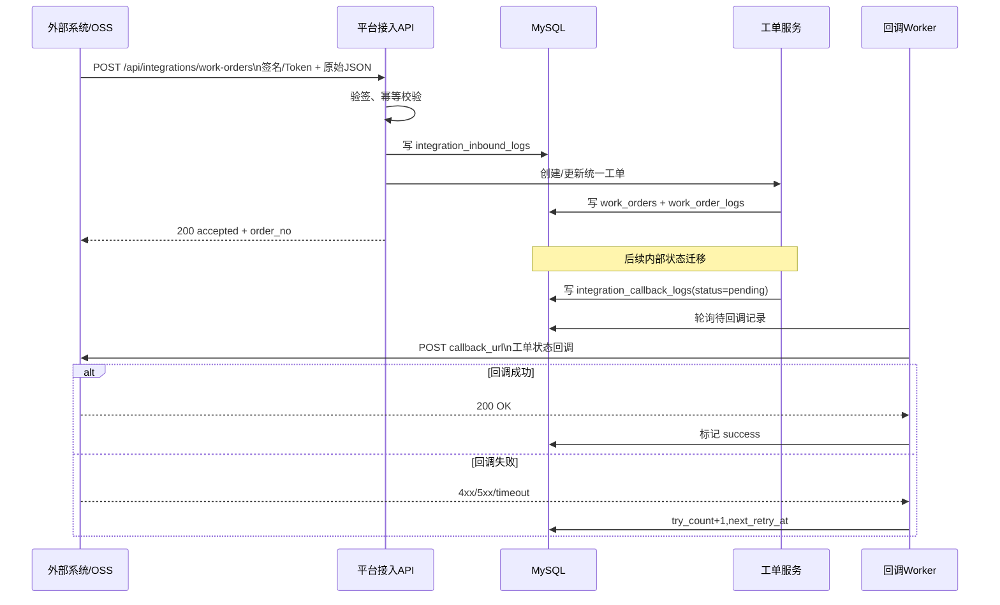
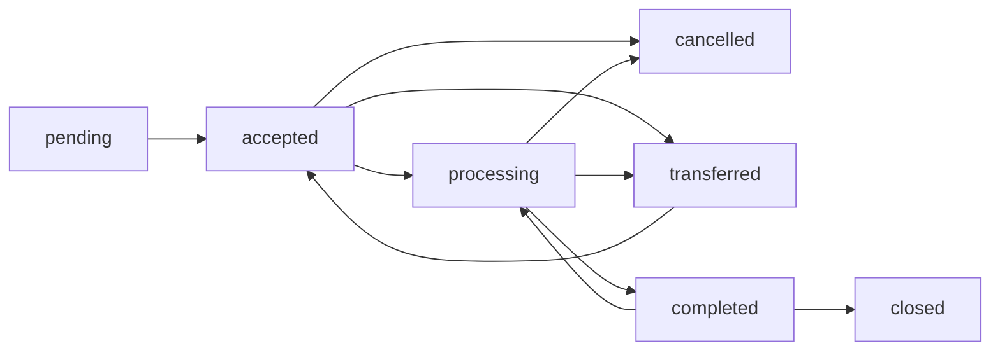

# 《智维助手小程序统一工单与用户体系项目实施指南》

> **历史规划说明（2026-08-12）**：本文早期按“新建独立平台和数据库”的假设编写，该假设已废止。当前权威方案见 `PROJECT_PLAN.md`、`DATABASE_DESIGN.md` 和 `docs/SMART_INSTALLATION_DATABASE_V2.md`：智能装维必须融合现有智维平台并复用 `anbo_wx`、现有用户/组织/角色及 `users.oss_*` 字段。本文其余内容仅保留作历史需求参考，不得据此创建平行身份体系或数据库。

## 执行摘要

我将本项目定义为：在**不推翻现有小程序技术栈**的前提下，把“智维助手”从当前偏单点工具/OSS外挂式能力，升级为一个面向江苏有线南京分公司内部使用的**统一用户体系 + 统一工单池 + OSS兼容接入 + 运维工具聚合入口**。从技术可行性看，继续沿用 **uni-app 小程序前端 + Flask 后端 + MySQL** 是可落地且适合两周内由两人配合 Codex 推进的方案：uni-app 原生支持页面路由、底部 tabBar、本地缓存、定位和文件上传；Flask 的 Blueprint 机制适合按模块拆分大型应用，官方测试文档也直接给出了基于 `pytest` 与 test client 的接口测试方式；MySQL 原生支持 `JSON`、外键与索引，适合做统一工单主模型与外部系统原始载荷并存的设计。citeturn3view3turn5view0turn6view0turn6view2turn7view0turn7view1turn10view0turn11view0turn11view2turn11view3

我对这份指南的核心判断是：**统一工单池必须把 OSS 工单纳入“统一工单主表”治理，但不等于第一阶段就把 OSS 原生流程完全替代掉。** 更稳妥的做法是先做“双轨制”：一方面保留 OSS 账号绑定、OSS 工单查询、OSS 原始详情查看；另一方面提供“同步到统一工单池”的标准入池动作，把 OSS 工单映射为统一工单，并通过 `source_system=OSS`、`external_order_id`、`external_status`、`source_payload_json` 等字段保留来源差异。这样既不阻塞当前业务，也能为后续统一统计、权限控制、工单闭环、回调同步打基础。MySQL 对 JSON 文档有原生校验和存储优化，但 JSON 字段不适合做高频筛选主索引，所以**统一工单的关键查询字段必须结构化入列，源系统差异才放 JSON**。citeturn10view0turn11view2

我会把 Codex 的角色严格限定为**执行器**而不是“二次产品经理”。OpenAI 官方对 Codex 的说明明确提到：Codex 可以被仓库中的 `AGENTS.md` 指导，且更适合在“配置清晰、测试可靠、文档明确”的项目中工作；其官方工作约束还强调，若修改文件，应使用 Git 提交、保持工作树干净，并优先遵守仓库内 `AGENTS.md` 的作用域规则。基于这一点，本指南把 `AGENTS.md`、`PROJECT_PLAN.md`、`DATABASE_DESIGN.md`、`API_DESIGN.md`、`TASK_LOG.md`、`CHANGELOG.md`、`QUESTIONS.md` 设计成强约束入口文件，并要求 Codex 每个 Task 完成后必须更新日志并提交。citeturn19view0

我对未提供信息的处理原则如下：凡用户未指定的旧项目路径、OSS 账号加密方式、短信服务商、服务器 Host/IP、Web 管理端技术框架、现有仓库目录名、OSS 原始字段名与状态枚举，**统一标注为“未指定”**；但我会同时给出模板、占位符和落地默认值，便于你们先做可执行版本，再用真实信息替换。

## 项目定位与总体技术路线

我对项目的定位不是“做一个新的工单页面”，而是做一个**移动端优先、后台治理逐步补齐**的运维入口中台。移动端优先的原因很明确：现场施工、接单、处理、拍照、定位、评价回收都天然发生在手机端；而更适合 Web 的，是批量配置、用户与菜单治理、角色权限和审计。第一阶段 therefore 以小程序为主、Web 管理端后补；但从数据结构与 API 层面，一开始就要按“多端共用一套后端”设计。uni-app 的 `pages.json` 本身就是全局路由与 tabBar 配置中心，底部原生 tabbar 也在这里定义，因此“菜单 + 我的”的双 Tab 方案可以直接用现有能力实现，而不必手工造轮子。citeturn3view3

我建议的仓库目标结构如下；如果现有仓库目录不同，Codex 只需保留原目录名，并在 `AGENTS.md` 中记录“实际目录 → 本指南目录名”的映射即可：

```text
project-root/
├─ AGENTS.md
├─ PROJECT_PLAN.md
├─ DATABASE_DESIGN.md
├─ API_DESIGN.md
├─ TASK_LOG.md
├─ CHANGELOG.md
├─ QUESTIONS.md
├─ docs/
│  ├─ old-project/
│  ├─ diagrams/
│  └─ sql/
├─ reference/
│  └─ old_project/              # 复制的旧小程序/旧OSS项目，只读分析区
├─ backend/
│  ├─ app/
│  │  ├─ blueprints/
│  │  │  ├─ auth/
│  │  │  ├─ admin/
│  │  │  ├─ workorders/
│  │  │  ├─ integrations/
│  │  │  ├─ oss/
│  │  │  ├─ network/
│  │  │  └─ common/
│  │  ├─ models/
│  │  ├─ services/
│  │  ├─ adapters/
│  │  ├─ utils/
│  │  └─ config/
│  ├─ migrations/
│  ├─ tests/
│  ├─ wsgi.py
│  └─ requirements.txt
├─ miniapp/
│  ├─ pages.json
│  ├─ manifest.json
│  ├─ pages/
│  ├─ components/
│  ├─ api/
│  ├─ store/
│  └─ utils/
├─ admin-web/                   # 未指定，若后续补做
├─ scripts/
│  ├─ bootstrap.sh
│  ├─ deploy.sh
│  ├─ run_backend.sh
│  ├─ run_worker.sh
│  ├─ sync_oss.sh
│  └─ backup_db.sh
└─ .gitignore
```

后端采用 Flask 的 Blueprint 模块化方式拆成 `auth / admin / workorders / integrations / oss / network / common` 六大域，是因为 Flask 官方明确把 Blueprint 作为大型应用拆分、复用 URL 前缀和统一注册资源的推荐机制；测试层则用 `pytest + Flask test_client`，因为官方文档直接支持在 `tests/` 目录中，用 `client.get()/post()` 发送 `query_string`、`headers`、`json`、`multipart/form-data` 请求。这样 Codex 在每个 Task 都能把“代码 + 测试”成对交付，而不是只生成代码。citeturn7view0turn7view1

安全路线方面，我建议内部用户登录采用**后端签发的 Bearer Token 会话**，不在 URL 上传递 token。RFC 6750 明确建议客户端优先使用 `Authorization: Bearer <token>` 头携带访问令牌，且不推荐把 bearer token 放进页面 URL，因为 URL 容易被历史记录、日志和其他软件结构泄露。外部系统接入则采用“双模式”：可信内网简单系统可配置静态 token，跨系统正式接入默认使用 `HMAC-SHA256` 签名；Python 官方 `hmac` 文档与 GitHub/Stripe 官方 webhook 文档都强调，签名校验应基于**原始请求体**、使用常量时间比较函数，并保证验证前载荷与头部不被中间件改写。citeturn13view2turn13view1turn12view1turn15view0turn16view1turn16view2

我对前端风格的统一要求如下。它完全来自你的偏好，不需要 Codex 再思考：
页面风格必须是**简洁、清晰、分区明确、信息优先**；避免大面积卡片堆叠、强玻璃态、过度 AI 风格渐变；优先采用浅底色、细分隔线、1 级标题 + 2 级字段组结构。底部第一期只保留两个 Tab：`菜单` 与 `我的`。所有业务功能——包括统一工单池、OSS 工单查询、网管工具、用户管理——都从菜单页进入。这样既保留了入口清晰度，也避免底部 tab 过多导致层级失控。

我对未指定项的假设如下：

| 项目 | 当前状态 | 处理方式 |
|---|---|---|
| 旧小程序/旧 OSS 项目路径 | 未指定 | 先在 `AGENTS.md` 中留空并要求人工填写 |
| 服务器 Host/IP | 未指定 | 仅记录逻辑名 `JSCN-233`，SSH 命令用 `<host-or-ip>` 占位 |
| Web 管理端技术栈 | 未指定 | 第一版只约束接口与页面职责，不强行选型 |
| 短信服务商 | 未指定 | 评价防伪先做验证码字段/流程预留，短信网关用适配器接口占位 |
| OSS 原始接口/爬取方式 | 未指定 | 以旧项目分析结果为准，先建立 adapter 抽象层 |
| OSS 字段名/状态枚举 | 未指定 | 先给出映射模板，Task 17/18 时落到真实值 |
| 现有数据库名 | 未指定 | 默认建议 `zhiwei_assistant` 或 `anbo_workorder` |
| OSS 账号加密方式 | 未指定 | 默认采用应用层对称加密，密钥走 `.env` |

## 数据库设计

我建议数据库统一使用 **MySQL 8.x + InnoDB + `utf8mb4`**。理由很直接：MySQL 的 `utf8mb4` 能覆盖 BMP 及补充字符，最多 4 字节每字符，适合中文、工单备注、用户昵称和特殊字符；外键有助于保证用户、角色、工单、日志之间关系一致；`JSON` 字段能原样保存 OSS 或外部系统的源载荷和扩展字段，但 JSON 列本身不适合直接承担主要筛选索引，因此高频筛选项必须独立成结构化字段。citeturn11view3turn11view0turn10view0

我采用以下建模原则：

1. **统一工单主表结构化，来源差异 JSON 化。**
2. **所有状态变更写日志，不允许前端直接 update `status`。**
3. **所有敏感凭证不明文存储。** 用户密码必须使用安全哈希；Werkzeug 官方安全工具默认提供 `scrypt` 哈希，并可用 `check_password_hash()` 校验。OSS 账号密码不做单向哈希，而做可解密加密存储，建议用 Fernet；其文档说明它提供对称加密、完整性保护和密钥轮换能力。citeturn8view0turn12view0

我建议把表分成三域：**用户与权限域、工单域、集成与审计域**。下面的结构已经足够让 Codex 直接建模。

**用户与权限域**

`users`

| 字段 | 类型 | 说明 | 约束 |
|---|---|---|---|
| id | bigint unsigned | 主键 | PK |
| username | varchar(64) | 登录名 | UK |
| password_hash | varchar(255) | 密码哈希 | NOT NULL |
| real_name | varchar(64) | 真实姓名 |  |
| phone | varchar(32) | 手机号 | IDX |
| email | varchar(128) | 邮箱 | 可空 |
| department_code | varchar(64) | 部门编码 | IDX |
| department_name | varchar(128) | 部门名称 |  |
| user_type | varchar(32) | `internal/external/system` | IDX |
| status | varchar(32) | `active/inactive/locked` | IDX |
| last_login_at | datetime(3) | 最后登录时间 |  |
| created_at | datetime(3) | 创建时间 |  |
| updated_at | datetime(3) | 更新时间 |  |
| deleted_at | datetime(3) | 软删除时间 | 可空 |

`roles`

| 字段 | 类型 | 说明 | 约束 |
|---|---|---|---|
| id | bigint unsigned | 主键 | PK |
| code | varchar(64) | 角色编码，如 `admin/engineer/supervisor` | UK |
| name | varchar(64) | 角色名 |  |
| scope_type | varchar(32) | `self/team/all/system` |  |
| status | varchar(32) | 启用状态 |  |
| created_at | datetime(3) | 创建时间 |  |
| updated_at | datetime(3) | 更新时间 |  |

`permissions`

| 字段 | 类型 | 说明 | 约束 |
|---|---|---|---|
| id | bigint unsigned | 主键 | PK |
| code | varchar(128) | 权限码，如 `workorder.accept` | UK |
| name | varchar(128) | 权限名 |  |
| module | varchar(64) | 模块域 | IDX |
| action | varchar(64) | 行为 |  |
| created_at | datetime(3) | 创建时间 |  |
| updated_at | datetime(3) | 更新时间 |  |

`menus`

| 字段 | 类型 | 说明 | 约束 |
|---|---|---|---|
| id | bigint unsigned | 主键 | PK |
| parent_id | bigint unsigned | 父菜单 | IDX |
| name | varchar(64) | 菜单名 |  |
| code | varchar(64) | 菜单编码 | UK |
| path | varchar(255) | 前端路由 |  |
| icon | varchar(64) | 图标 | 可空 |
| sort_order | int | 排序 | IDX |
| menu_group | varchar(64) | 菜单分组，如 `workorder/network/admin` | IDX |
| visible | tinyint(1) | 是否显示 |  |
| status | varchar(32) | 启用状态 |  |
| created_at | datetime(3) | 创建时间 |  |
| updated_at | datetime(3) | 更新时间 |  |

`user_roles`

| 字段 | 类型 | 说明 | 约束 |
|---|---|---|---|
| id | bigint unsigned | 主键 | PK |
| user_id | bigint unsigned | 用户ID | FK/IDX |
| role_id | bigint unsigned | 角色ID | FK/IDX |
| created_at | datetime(3) | 创建时间 |  |
| updated_at | datetime(3) | 更新时间 |  |
| unique_key | - | 唯一约束 | UK(user_id, role_id) |

`role_permissions`

| 字段 | 类型 | 说明 | 约束 |
|---|---|---|---|
| id | bigint unsigned | 主键 | PK |
| role_id | bigint unsigned | 角色ID | FK/IDX |
| permission_id | bigint unsigned | 权限ID | FK/IDX |
| created_at | datetime(3) | 创建时间 |  |
| unique_key | - | 唯一约束 | UK(role_id, permission_id) |

`auth_tokens`

| 字段 | 类型 | 说明 | 约束 |
|---|---|---|---|
| id | bigint unsigned | 主键 | PK |
| user_id | bigint unsigned | 用户ID | FK/IDX |
| token_hash | varchar(128) | Bearer Token 的哈希 | UK |
| device_type | varchar(32) | `miniapp/web/api` | IDX |
| device_name | varchar(128) | 设备名 | 可空 |
| ip | varchar(64) | 登录IP |  |
| user_agent | varchar(255) | UA摘要 |  |
| expires_at | datetime(3) | 过期时间 | IDX |
| revoked_at | datetime(3) | 吊销时间 | IDX |
| created_at | datetime(3) | 创建时间 |  |

**工单域**

`work_orders`

| 字段 | 类型 | 说明 | 约束 |
|---|---|---|---|
| id | bigint unsigned | 主键 | PK |
| order_no | varchar(64) | 平台统一工单号 | UK |
| source_system | varchar(32) | `INTERNAL/OSS/EXT_*` | IDX |
| source_module | varchar(64) | 来源模块，如 `oss-repair` | IDX |
| external_order_id | varchar(128) | 外部工单号 | IDX |
| external_status | varchar(64) | 外部状态原文 | IDX |
| sync_mode | varchar(32) | `import_only/bidirectional/disabled` |  |
| title | varchar(255) | 工单标题 | IDX |
| description | text | 工单描述 |  |
| order_type | varchar(64) | 工单类型 | IDX |
| business_type | varchar(64) | 业务类型 | IDX |
| priority | varchar(16) | `P1/P2/P3/P4` | IDX |
| status | varchar(32) | 平台统一状态 | IDX |
| status_reason | varchar(255) | 状态说明 | 可空 |
| creator_id | bigint unsigned | 创建人 | FK/IDX |
| assignee_id | bigint unsigned | 当前处理人 | FK/IDX |
| assignee_name | varchar(64) | 冗余显示名 |  |
| team_code | varchar(64) | 班组/片区 | IDX |
| department_code | varchar(64) | 归属部门 | IDX |
| customer_name | varchar(128) | 客户姓名 | IDX |
| customer_phone | varchar(32) | 客户电话 | IDX |
| service_no | varchar(64) | 业务号码/宽带号 | IDX |
| address | varchar(255) | 地址文本 | IDX |
| longitude | decimal(10,6) | 经度 |  |
| latitude | decimal(10,6) | 纬度 |  |
| accept_deadline_at | datetime(3) | 接单 SLA 截止 | IDX |
| finish_deadline_at | datetime(3) | 完工 SLA 截止 | IDX |
| source_payload_json | json | 原始源数据快照 |  |
| extra_json | json | 扩展字段 |  |
| last_synced_at | datetime(3) | 最近同步时间 | IDX |
| closed_at | datetime(3) | 关闭时间 | IDX |
| created_at | datetime(3) | 创建时间 | IDX |
| updated_at | datetime(3) | 更新时间 | IDX |
| deleted_at | datetime(3) | 软删除时间 | IDX |
| unique_key | - | 幂等约束 | UK(source_system, external_order_id) |

`work_order_logs`

| 字段 | 类型 | 说明 | 约束 |
|---|---|---|---|
| id | bigint unsigned | 主键 | PK |
| work_order_id | bigint unsigned | 工单ID | FK/IDX |
| action | varchar(64) | `create/accept/transfer/complete/close/sync_in/sync_out` | IDX |
| from_status | varchar(32) | 变更前状态 |  |
| to_status | varchar(32) | 变更后状态 |  |
| operator_id | bigint unsigned | 操作人 | FK/IDX |
| operator_name | varchar(64) | 操作人名 |  |
| operator_role | varchar(64) | 操作角色 |  |
| note | text | 操作说明 |  |
| extra_json | json | 扩展信息 |  |
| created_at | datetime(3) | 创建时间 | IDX |

`work_order_comments`

| 字段 | 类型 | 说明 | 约束 |
|---|---|---|---|
| id | bigint unsigned | 主键 | PK |
| work_order_id | bigint unsigned | 工单ID | FK/IDX |
| comment_type | varchar(32) | `internal/public/system` | IDX |
| content | text | 备注内容 |  |
| creator_id | bigint unsigned | 备注人 | FK/IDX |
| creator_name | varchar(64) | 备注人名 |  |
| created_at | datetime(3) | 创建时间 | IDX |

`work_order_site_records`

| 字段 | 类型 | 说明 | 约束 |
|---|---|---|---|
| id | bigint unsigned | 主键 | PK |
| work_order_id | bigint unsigned | 工单ID | FK/IDX |
| operator_id | bigint unsigned | 现场处理人 | FK/IDX |
| operator_name | varchar(64) | 现场处理人名 |  |
| arrive_at | datetime(3) | 到场时间 | 可空 |
| finish_at | datetime(3) | 完工时间 | 可空 |
| longitude | decimal(10,6) | 经度 |  |
| latitude | decimal(10,6) | 纬度 |  |
| accuracy_m | decimal(8,2) | 定位精度米 | 可空 |
| address_text | varchar(255) | 文本地址 | 可空 |
| work_summary | text | 处理说明 |  |
| signature_name | varchar(64) | 客户签字姓名，若启用 | 可空 |
| created_at | datetime(3) | 创建时间 | IDX |
| updated_at | datetime(3) | 更新时间 | IDX |

`work_order_photos`

| 字段 | 类型 | 说明 | 约束 |
|---|---|---|---|
| id | bigint unsigned | 主键 | PK |
| work_order_id | bigint unsigned | 工单ID | FK/IDX |
| site_record_id | bigint unsigned | 现场记录ID | FK/IDX |
| file_id | bigint unsigned | 文件ID | FK/IDX |
| photo_type | varchar(32) | `before/after/environment/other` | IDX |
| sort_order | int | 排序 |  |
| created_at | datetime(3) | 创建时间 |  |

`work_order_evaluations`

| 字段 | 类型 | 说明 | 约束 |
|---|---|---|---|
| id | bigint unsigned | 主键 | PK |
| work_order_id | bigint unsigned | 工单ID | FK/IDX |
| rating | tinyint unsigned | 评分 1-5 | IDX |
| tags_json | json | 标签 |  |
| content | text | 评价内容 |  |
| verify_mode | varchar(32) | `sms/code/link/manual` | IDX |
| verify_target | varchar(128) | 手机号/短码接收方 |  |
| verify_code_hash | varchar(255) | 验证码哈希 | 可空 |
| verified_at | datetime(3) | 验证通过时间 | IDX |
| evaluator_name | varchar(64) | 评价人 | 可空 |
| relation_confirmed | tinyint(1) | 是否确认本人 |  |
| created_at | datetime(3) | 创建时间 | IDX |

`files`

| 字段 | 类型 | 说明 | 约束 |
|---|---|---|---|
| id | bigint unsigned | 主键 | PK |
| biz_type | varchar(32) | `site_photo/avatar/export/temp` | IDX |
| storage_driver | varchar(32) | `local/minio/oss` | IDX |
| original_name | varchar(255) | 原文件名 |  |
| ext | varchar(16) | 扩展名 |  |
| mime_type | varchar(128) | MIME |  |
| size_bytes | bigint unsigned | 大小 | IDX |
| sha256 | varchar(64) | 指纹 | IDX |
| storage_path | varchar(255) | 存储路径 | UK |
| uploader_id | bigint unsigned | 上传人 | FK/IDX |
| created_at | datetime(3) | 创建时间 | IDX |

**集成与审计域**

`external_accounts`

| 字段 | 类型 | 说明 | 约束 |
|---|---|---|---|
| id | bigint unsigned | 主键 | PK |
| user_id | bigint unsigned | 用户ID | FK/IDX |
| system_name | varchar(32) | `OSS` 等 | IDX |
| account | varchar(128) | 外部账号 |  |
| encrypted_secret | text | 加密后的密码/令牌 |  |
| secret_hint | varchar(32) | 脱敏提示 | 可空 |
| ext_config_json | json | 额外配置 |  |
| status | varchar(32) | `active/inactive/error` | IDX |
| last_verify_at | datetime(3) | 最近验证时间 | IDX |
| created_at | datetime(3) | 创建时间 |  |
| updated_at | datetime(3) | 更新时间 |  |
| unique_key | - | 唯一约束 | UK(user_id, system_name) |

`integration_endpoints`

| 字段 | 类型 | 说明 | 约束 |
|---|---|---|---|
| id | bigint unsigned | 主键 | PK |
| app_id | varchar(64) | 外部系统标识 | UK |
| app_name | varchar(128) | 系统名称 |  |
| auth_mode | varchar(32) | `token/hmac` | IDX |
| secret_ciphertext | text | 加密后的 token/secret |  |
| callback_url | varchar(255) | 回调地址 |  |
| status | varchar(32) | 启停状态 | IDX |
| allowed_events_json | json | 允许事件列表 |  |
| last_rotate_at | datetime(3) | 最近轮换密钥时间 |  |
| created_at | datetime(3) | 创建时间 |  |
| updated_at | datetime(3) | 更新时间 |  |

`integration_inbound_logs`

| 字段 | 类型 | 说明 | 约束 |
|---|---|---|---|
| id | bigint unsigned | 主键 | PK |
| app_id | varchar(64) | 外部系统标识 | IDX |
| event_id | varchar(128) | 外部事件ID | IDX |
| nonce | varchar(128) | 随机串 | IDX |
| request_path | varchar(255) | 请求路径 |  |
| method | varchar(16) | HTTP 方法 |  |
| body_sha256 | varchar(64) | 原始载荷哈希 | IDX |
| verified | tinyint(1) | 签名是否通过 | IDX |
| dedup_hit | tinyint(1) | 是否命中幂等 | IDX |
| http_status | int | 平台返回状态码 | IDX |
| result_code | varchar(64) | 业务结果码 | IDX |
| request_body_json | json | 请求载荷 |  |
| response_body_json | json | 响应载荷 |  |
| created_at | datetime(3) | 创建时间 | IDX |
| unique_key | - | 建议幂等唯一键 | UK(app_id, event_id) |

`integration_callback_logs`

| 字段 | 类型 | 说明 | 约束 |
|---|---|---|---|
| id | bigint unsigned | 主键 | PK |
| work_order_id | bigint unsigned | 工单ID | FK/IDX |
| app_id | varchar(64) | 回调目标系统 | IDX |
| event_type | varchar(64) | `work_order.accepted` 等 | IDX |
| callback_url | varchar(255) | 回调地址 |  |
| payload_json | json | 负载 |  |
| body_sha256 | varchar(64) | 体摘要 | IDX |
| try_count | int | 已重试次数 | IDX |
| next_retry_at | datetime(3) | 下次重试时间 | IDX |
| status | varchar(32) | `pending/success/failed/dead` | IDX |
| last_http_status | int | 最近 HTTP 状态 | IDX |
| last_error | varchar(255) | 最近错误 | 可空 |
| response_body_text | text | 返回体摘要 | 可空 |
| created_at | datetime(3) | 创建时间 | IDX |
| updated_at | datetime(3) | 更新时间 | IDX |

`operation_logs`

| 字段 | 类型 | 说明 | 约束 |
|---|---|---|---|
| id | bigint unsigned | 主键 | PK |
| operator_id | bigint unsigned | 操作人 | IDX |
| module | varchar(64) | 模块，如 `user/workorder/menu` | IDX |
| action | varchar(64) | 行为 | IDX |
| target_type | varchar(64) | 目标类型 | IDX |
| target_id | varchar(128) | 目标ID | IDX |
| request_id | varchar(64) | 请求链路ID | IDX |
| ip | varchar(64) | IP |  |
| detail_json | json | 详情 |  |
| created_at | datetime(3) | 创建时间 | IDX |

`system_configs`

| 字段 | 类型 | 说明 | 约束 |
|---|---|---|---|
| id | bigint unsigned | 主键 | PK |
| config_key | varchar(128) | 配置键 | UK |
| config_value | json | 配置值 |  |
| description | varchar(255) | 注释 |  |
| updated_by | bigint unsigned | 更新人 | IDX |
| updated_at | datetime(3) | 更新时间 | IDX |

我建议 Codex 先直接生成 3 个关键表的 SQL 草案，后续再按同一风格扩展。关键表如下：

```sql
CREATE TABLE users (
  id BIGINT UNSIGNED PRIMARY KEY AUTO_INCREMENT,
  username VARCHAR(64) NOT NULL,
  password_hash VARCHAR(255) NOT NULL,
  real_name VARCHAR(64) NOT NULL,
  phone VARCHAR(32) DEFAULT NULL,
  email VARCHAR(128) DEFAULT NULL,
  department_code VARCHAR(64) DEFAULT NULL,
  department_name VARCHAR(128) DEFAULT NULL,
  user_type VARCHAR(32) NOT NULL DEFAULT 'internal',
  status VARCHAR(32) NOT NULL DEFAULT 'active',
  last_login_at DATETIME(3) DEFAULT NULL,
  created_at DATETIME(3) NOT NULL,
  updated_at DATETIME(3) NOT NULL,
  deleted_at DATETIME(3) DEFAULT NULL,
  UNIQUE KEY uk_users_username (username),
  KEY idx_users_phone (phone),
  KEY idx_users_department (department_code),
  KEY idx_users_status (status)
) ENGINE=InnoDB DEFAULT CHARSET=utf8mb4 COLLATE=utf8mb4_0900_ai_ci;
```

```sql
CREATE TABLE work_orders (
  id BIGINT UNSIGNED PRIMARY KEY AUTO_INCREMENT,
  order_no VARCHAR(64) NOT NULL,
  source_system VARCHAR(32) NOT NULL,
  source_module VARCHAR(64) DEFAULT NULL,
  external_order_id VARCHAR(128) DEFAULT NULL,
  external_status VARCHAR(64) DEFAULT NULL,
  sync_mode VARCHAR(32) NOT NULL DEFAULT 'import_only',
  title VARCHAR(255) NOT NULL,
  description TEXT,
  order_type VARCHAR(64) DEFAULT NULL,
  business_type VARCHAR(64) DEFAULT NULL,
  priority VARCHAR(16) NOT NULL DEFAULT 'P3',
  status VARCHAR(32) NOT NULL DEFAULT 'pending',
  status_reason VARCHAR(255) DEFAULT NULL,
  creator_id BIGINT UNSIGNED NOT NULL,
  assignee_id BIGINT UNSIGNED DEFAULT NULL,
  assignee_name VARCHAR(64) DEFAULT NULL,
  team_code VARCHAR(64) DEFAULT NULL,
  department_code VARCHAR(64) DEFAULT NULL,
  customer_name VARCHAR(128) DEFAULT NULL,
  customer_phone VARCHAR(32) DEFAULT NULL,
  service_no VARCHAR(64) DEFAULT NULL,
  address VARCHAR(255) DEFAULT NULL,
  longitude DECIMAL(10,6) DEFAULT NULL,
  latitude DECIMAL(10,6) DEFAULT NULL,
  accept_deadline_at DATETIME(3) DEFAULT NULL,
  finish_deadline_at DATETIME(3) DEFAULT NULL,
  source_payload_json JSON DEFAULT NULL,
  extra_json JSON DEFAULT NULL,
  last_synced_at DATETIME(3) DEFAULT NULL,
  closed_at DATETIME(3) DEFAULT NULL,
  created_at DATETIME(3) NOT NULL,
  updated_at DATETIME(3) NOT NULL,
  deleted_at DATETIME(3) DEFAULT NULL,
  UNIQUE KEY uk_work_orders_order_no (order_no),
  UNIQUE KEY uk_work_orders_source_external (source_system, external_order_id),
  KEY idx_work_orders_status (status),
  KEY idx_work_orders_assignee (assignee_id),
  KEY idx_work_orders_created_at (created_at),
  KEY idx_work_orders_updated_at (updated_at),
  KEY idx_work_orders_source (source_system, source_module),
  KEY idx_work_orders_priority (priority),
  KEY idx_work_orders_customer_phone (customer_phone)
) ENGINE=InnoDB DEFAULT CHARSET=utf8mb4 COLLATE=utf8mb4_0900_ai_ci;
```

```sql
CREATE TABLE integration_callback_logs (
  id BIGINT UNSIGNED PRIMARY KEY AUTO_INCREMENT,
  work_order_id BIGINT UNSIGNED NOT NULL,
  app_id VARCHAR(64) NOT NULL,
  event_type VARCHAR(64) NOT NULL,
  callback_url VARCHAR(255) NOT NULL,
  payload_json JSON NOT NULL,
  body_sha256 VARCHAR(64) NOT NULL,
  try_count INT NOT NULL DEFAULT 0,
  next_retry_at DATETIME(3) DEFAULT NULL,
  status VARCHAR(32) NOT NULL DEFAULT 'pending',
  last_http_status INT DEFAULT NULL,
  last_error VARCHAR(255) DEFAULT NULL,
  response_body_text TEXT,
  created_at DATETIME(3) NOT NULL,
  updated_at DATETIME(3) NOT NULL,
  KEY idx_callback_pending (status, next_retry_at),
  KEY idx_callback_app (app_id, event_type),
  KEY idx_callback_workorder (work_order_id)
) ENGINE=InnoDB DEFAULT CHARSET=utf8mb4 COLLATE=utf8mb4_0900_ai_ci;
```

统一状态建议固定为以下集合，前端只按动作按钮触发，后端负责检查是否允许迁移：

| 状态 | 含义 | 允许动作 |
|---|---|---|
| pending | 待处理/待分派 | 接单、转派、取消 |
| accepted | 已接单 | 开始处理、转派、取消 |
| processing | 处理中 | 记录现场、追加备注、完工、转派 |
| completed | 已完工待关闭 | 回填评价、关闭、驳回重开 |
| closed | 已关闭 | 查看、导出 |
| cancelled | 已取消 | 查看、重建 |
| rejected | 已驳回 | 修改后重提，若业务需要 |

状态设计不需要遵循 OSS 的原始状态枚举；OSS 原始状态保存在 `external_status`，统一状态才用于列表筛选、权限控制、SLA 与统计。

## API 设计与鉴权签名规范

我建议所有接口统一采用如下响应壳：

```json
{
  "request_id": "20260526-abc123",
  "code": "OK",
  "message": "success",
  "data": {}
}
```

错误响应统一为：

```json
{
  "request_id": "20260526-abc123",
  "code": "WO_STATE_CONFLICT",
  "message": "当前工单状态不允许执行 complete",
  "data": null
}
```

HTTP 状态语义我建议严格化：缺失或错误凭证返回 `401`，权限不足返回 `403`，状态冲突或重复入池返回 `409`。RFC 9110 对 401、403、409 的定义正好对应这三种情形：401 用于挑战或提示重新提供授权信息，403 表示服务器理解请求但拒绝执行，409 则用于当前资源状态与请求冲突且用户可修正后重试的场景。citeturn13view3turn13view4turn13view5

内部接口统一使用：

```http
Authorization: Bearer <token>
X-Request-Id: <uuid-or-snowflake>
```

原因是 RFC 6750 建议资源服务器支持使用 `Authorization` 头中的 `Bearer` 方案携带 access token，并且不推荐把 token 放进 URL 参数。为了方便失效控制与单设备剔除，我不建议第一版使用纯 JWT；而是建议由服务端生成随机 token，数据库只存 `token_hash`，请求时比对哈希并检查 `expires_at/revoked_at`。Bearer 只是传输格式；token 本身完全可以是自定义会话令牌。citeturn13view2turn13view1

外部系统接入支持两种鉴权模式：

**静态 Token 模式**

```http
Authorization: Bearer <integration_token>
X-App-Id: ext-repair-center
X-Request-Id: ext-20260526-0001
```

**HMAC-SHA256 签名模式**

```http
X-App-Id: ext-repair-center
X-Timestamp: 1748227200
X-Nonce: 3b06d6d0e2f8477fa7
X-Sign-Version: v1
X-Signature: 9c8d2a...
Content-Type: application/json
```

签名串我建议固定为：

```text
METHOD \n
PATH \n
X-Timestamp \n
X-Nonce \n
SHA256(raw_body)
```

签名算法：

```python
signature = hmac.new(secret, signing_string, hashlib.sha256).hexdigest()
```

签名校验必须满足四条规则。第一，使用原始请求体而不是已反序列化 JSON；Stripe 和 GitHub 文档都强调，签名前如果 body 或 headers 被中间件改写，验证会失败。第二，比较过程使用 `hmac.compare_digest()`，避免普通 `==` 带来的时序攻击风险。第三，编码统一按 UTF-8 处理。第四，请求体经过验签前禁止修改。citeturn15view0turn16view1turn16view2turn12view1

我建议签名时效窗口为 **±300 秒**，并在 `integration_inbound_logs` 中记录 `app_id + event_id`；若对方没有 `event_id`，则退化为 `app_id + body_sha256 + minute_bucket` 的软幂等策略。对幂等重复请求，平台返回 `200`，`code=DUPLICATE_OK`，并返回已存在工单映射，而不是错误终止。

我建议把 API 按域拆成以下集合。这里的“权限控制”是 Codex 生成路由时必须写进注释与代码中的明确约束。

**认证域**

| 方法 | 路径 | 说明 | 权限 |
|---|---|---|---|
| POST | `/api/auth/login` | 账号密码登录 | 匿名 |
| POST | `/api/auth/logout` | 登出并吊销当前 token | 已登录 |
| GET | `/api/auth/me` | 获取当前用户与权限 | 已登录 |
| POST | `/api/auth/change-password` | 修改密码 | 已登录 |
| POST | `/api/auth/wechat-login` | 预留：微信 code 登录 | 未指定，默认不开启 |

微信登录若未来启用，`code` 换取 `openid/session_key` 必须在开发者服务器后台完成；uni-app 文档也提示，某些微信登录配置若把 `appsecret` 放到前端配置里存在泄露风险，因此本项目一律禁止把此类关键凭证写入小程序端。citeturn6view3turn2academia1

登录请求示例：

```json
{
  "username": "admin",
  "password": "******"
}
```

登录响应示例：

```json
{
  "request_id": "20260526-a1",
  "code": "OK",
  "message": "success",
  "data": {
    "token": "plain-token-only-once-returned",
    "expires_at": "2026-05-26T18:00:00+08:00",
    "user": {
      "id": 1,
      "username": "admin",
      "real_name": "系统管理员",
      "department_code": "NJOPS",
      "roles": ["admin"],
      "permissions": [
        "menu.view",
        "user.manage",
        "workorder.view_all",
        "workorder.transfer",
        "oss.account.bind",
        "oss.workorder.sync"
      ]
    }
  }
}
```

**菜单与用户域**

| 方法 | 路径 | 说明 | 权限 |
|---|---|---|---|
| GET | `/api/menus/my` | 当前用户可见菜单树 | `menu.view` |
| GET | `/api/admin/users` | 用户列表 | `user.view` |
| POST | `/api/admin/users` | 新增用户 | `user.manage` |
| GET | `/api/admin/users/{id}` | 用户详情 | `user.view` |
| PUT | `/api/admin/users/{id}` | 编辑用户 | `user.manage` |
| POST | `/api/admin/users/{id}/reset-password` | 管理员重置密码 | `user.manage` |
| PUT | `/api/admin/users/{id}/status` | 启/停用用户 | `user.manage` |
| GET | `/api/admin/roles` | 角色列表 | `role.view` |
| POST | `/api/admin/roles` | 新增角色 | `role.manage` |
| GET | `/api/admin/menus` | 菜单管理列表 | `menu.manage` |
| POST | `/api/admin/menus` | 新增菜单 | `menu.manage` |
| PUT | `/api/admin/menus/{id}` | 编辑菜单 | `menu.manage` |

`GET /api/admin/users` 查询参数建议：

```http
GET /api/admin/users?page=1&page_size=20&keyword=张三&department_code=NJOPS&status=active&role_code=engineer
```

**工单域**

| 方法 | 路径 | 说明 | 权限 |
|---|---|---|---|
| GET | `/api/work-orders` | 工单列表 | `workorder.view_self/team/all` 之一 |
| POST | `/api/work-orders` | 新建内部工单 | `workorder.create` |
| GET | `/api/work-orders/{id}` | 工单详情 | 可见范围内 |
| POST | `/api/work-orders/{id}/accept` | 接单 | `workorder.accept` |
| POST | `/api/work-orders/{id}/transfer` | 转派 | `workorder.transfer` |
| POST | `/api/work-orders/{id}/start` | 开始处理 | `workorder.process` |
| POST | `/api/work-orders/{id}/complete` | 完工 | `workorder.complete` |
| POST | `/api/work-orders/{id}/close` | 关闭 | `workorder.close` |
| POST | `/api/work-orders/{id}/cancel` | 取消 | `workorder.cancel` |
| POST | `/api/work-orders/{id}/comment` | 追加备注 | `workorder.comment` |
| POST | `/api/work-orders/{id}/site-record` | 提交现场记录 | `workorder.site` |
| POST | `/api/work-orders/{id}/evaluation` | 提交评价 | 工单可评价且验证通过 |
| GET | `/api/work-orders/{id}/logs` | 查看流转日志 | 工单可见范围内 |

工单列表的后端查询参数必须在第一版就定清楚，否则前后端会反复扯皮。我建议：

| 参数名 | 类型 | 说明 |
|---|---|---|
| page | int | 页码 |
| page_size | int | 每页条数，默认 20，最大 100 |
| scope | string | `self/team/all` |
| keyword | string | 模糊匹配工单号、外部工单号、客户名、电话、业务号、地址 |
| source_system | string | `INTERNAL/OSS/EXT_xxx` |
| source_module | string | 来源模块 |
| status | string | 逗号分隔状态 |
| priority | string | 逗号分隔优先级 |
| order_type | string | 工单类型 |
| business_type | string | 业务类型 |
| department_code | string | 部门 |
| assignee_id | bigint | 当前处理人 |
| creator_id | bigint | 创建人 |
| created_from | datetime | 创建开始 |
| created_to | datetime | 创建结束 |
| updated_from | datetime | 更新时间开始 |
| updated_to | datetime | 更新时间结束 |
| evaluation_status | string | `none/pending/done` |
| sync_mode | string | `import_only/bidirectional/disabled` |
| has_location | bool | 是否已回填定位 |
| sort | string | 如 `-updated_at` |

查询示例：

```http
GET /api/work-orders?page=1&page_size=20&scope=self&keyword=宽带&source_system=OSS&status=pending,accepted,processing&priority=P1,P2&created_from=2026-05-01T00:00:00+08:00&created_to=2026-05-26T23:59:59+08:00&sort=-updated_at
```

返回示例：

```json
{
  "request_id": "20260526-wo1",
  "code": "OK",
  "message": "success",
  "data": {
    "page": 1,
    "page_size": 20,
    "total": 156,
    "items": [
      {
        "id": 1001,
        "order_no": "WO202605260001",
        "source_system": "OSS",
        "external_order_id": "OSS-8899123",
        "title": "用户宽带中断",
        "priority": "P2",
        "status": "processing",
        "customer_name": "张某",
        "customer_phone": "138****1234",
        "address": "南京市鼓楼区***",
        "assignee_name": "李工",
        "updated_at": "2026-05-26T10:03:11+08:00"
      }
    ]
  }
}
```

接单接口示例：

```json
POST /api/work-orders/1001/accept
{
  "note": "我已确认接单，预计20分钟到场"
}
```

状态动作接口若与当前状态冲突，返回：

```json
{
  "request_id": "20260526-wo2",
  "code": "WO_STATE_CONFLICT",
  "message": "当前状态 completed 不允许执行 accept",
  "data": null
}
```

HTTP 状态为 `409`。citeturn13view5

**现场记录与文件域**

uni-app 的 `uni.uploadFile` 会向后端发起 `multipart/form-data` 的 `POST` 请求，且小程序平台要求事先配置域名白名单；Flask 侧可以通过 `MAX_CONTENT_LENGTH / MAX_FORM_MEMORY_SIZE / MAX_FORM_PARTS` 对上传大小和 multipart 字段数做限制，超限时抛出 `413`。因此我建议第一版图片上传限制为：单图 `<=10MB`，单次最多 `9` 张，总字段数不超过 `100`。citeturn6view0turn20view0turn20view1turn20view2

| 方法 | 路径 | 说明 | 权限 |
|---|---|---|---|
| POST | `/api/files/upload` | 上传图片/附件 | 已登录 |
| POST | `/api/work-orders/{id}/site-record` | 提交现场记录与图片 | `workorder.site` |

上传响应示例：

```json
{
  "request_id": "20260526-file1",
  "code": "OK",
  "message": "success",
  "data": {
    "file_id": 8001,
    "url": "/uploads/site/2026/05/26/abc.jpg",
    "size_bytes": 1827362,
    "sha256": "..."
  }
}
```

现场记录提交示例：

```json
{
  "arrive_at": "2026-05-26T10:20:00+08:00",
  "finish_at": "2026-05-26T10:58:00+08:00",
  "longitude": 118.780512,
  "latitude": 32.041544,
  "accuracy_m": 18.5,
  "address_text": "南京市鼓楼区某路某号",
  "work_summary": "更换尾纤并重启设备，业务恢复",
  "photos": [
    {"file_id": 8001, "photo_type": "before"},
    {"file_id": 8002, "photo_type": "after"}
  ]
}
```

**评价域**

评价提交必须做防伪。我建议第一版做“三层防伪”：

1. 只能对 `completed` 状态工单评价；
2. 评价链接或页面必须携带工单短链/二维码上下文；
3. 评价提交需经过验证码挑战，短信网关未指定时先使用“平台生成 6 位校验码 + 施工人员现场展示或电话告知 + 客户输入”的占位流程；后续再接短信服务商。

接口：

| 方法 | 路径 | 说明 | 权限 |
|---|---|---|---|
| POST | `/api/work-orders/{id}/evaluation/send-code` | 发送或生成验证码 | `workorder.evaluation.request` 或匿名短链 |
| POST | `/api/work-orders/{id}/evaluation/verify` | 校验验证码 | 匿名短链/客户态 |
| POST | `/api/work-orders/{id}/evaluation` | 提交评分与内容 | 已验证 |

这样做的目的很简单：避免工程师自行伪造“五星好评”。你要求的“验证码/短信机制防伪”会被平台数据结构完整保留，即使短信厂商还未指定，流程也不会失真。

**OSS 域**

| 方法 | 路径 | 说明 | 权限 |
|---|---|---|---|
| GET | `/api/oss/accounts/me` | 当前用户 OSS 账号信息 | `oss.account.bind` |
| POST | `/api/oss/accounts/me` | 绑定 OSS 账号 | `oss.account.bind` |
| PUT | `/api/oss/accounts/me` | 修改 OSS 账号 | `oss.account.bind` |
| DELETE | `/api/oss/accounts/me` | 解绑 OSS 账号 | `oss.account.bind` |
| POST | `/api/oss/accounts/me/verify` | 验证账号可用性 | `oss.account.bind` |
| GET | `/api/oss/work-orders` | 查询 OSS 工单 | `oss.workorder.query` |
| GET | `/api/oss/work-orders/{external_order_id}` | OSS 工单详情 | `oss.workorder.query` |
| POST | `/api/oss/work-orders/{external_order_id}/sync` | 同步入统一工单池 | `oss.workorder.sync` |
| POST | `/api/oss/work-orders/{id}/pull` | 刷新外部状态到本地 | `oss.workorder.sync` |
| POST | `/api/oss/work-orders/{id}/push-status` | 将统一工单状态回推 OSS | `oss.workorder.push` |

OSS 查询不等于统一工单查询。这里我要求保留两层数据：
第一层是“OSS 原始详情”，目的是让现场或调度仍能看到 OSS 的来源信息；第二层是“统一工单详情”，目的是进入平台状态机。`/sync` 动作如果命中相同 `source_system+external_order_id`，则返回现有平台工单而不是重复创建。

**外部系统接入与回调域**

| 方法 | 路径 | 说明 | 权限 |
|---|---|---|---|
| POST | `/api/integrations/work-orders` | 外部系统推工单入池 | token/hmac |
| PUT | `/api/integrations/work-orders/{external_order_id}/status` | 外部更新自身状态 | token/hmac |
| GET | `/api/integrations/work-orders/{external_order_id}` | 查询映射到的平台工单 | token/hmac |
| POST | `/api/internal/callback-dispatch` | 内部 Worker 使用，不对外 | 系统内部 |

推工单请求示例：

```json
{
  "event_id": "ext-evt-0001",
  "source_system": "EXT_REPAIR",
  "external_order_id": "RP-20260526-01",
  "external_status": "待派单",
  "title": "用户报修：无信号",
  "description": "用户家中电视无信号",
  "order_type": "repair",
  "priority": "P2",
  "customer_name": "王某",
  "customer_phone": "13900001111",
  "service_no": "02588889999",
  "address": "南京市玄武区***",
  "source_payload_json": {
    "raw": "..."
  }
}
```

推工单响应示例：

```json
{
  "request_id": "20260526-int1",
  "code": "OK",
  "message": "accepted",
  "data": {
    "work_order_id": 1001,
    "order_no": "WO202605260001",
    "dedup": false
  }
}
```

回调策略我建议用**数据库 outbox + 定时 Worker**，而不是第一版就上复杂队列。原因不是技术上不能，而是你要求两周内完成、且只有一台服务器。Worker 每分钟扫描一次 `integration_callback_logs` 中 `status=pending and next_retry_at<=now()` 的记录，逐条派发；成功则标记 `success`，失败按重试计划回写。外部 webhook/回调文档普遍强调应尽快返回成功响应，否则会被视为失败或超时；Stripe 文档明确建议在复杂逻辑前尽快返回 `2xx`，GitHub 也直接说明服务端超时超过 10 秒会记为失败。因此，外部入站接口只做“验签 + 落库 + 投递内部任务”，不做长链路处理。citeturn15view1turn16view4

建议重试计划：

| 次数 | 延迟 |
|---|---|
| 第 1 次 | 1 分钟 |
| 第 2 次 | 5 分钟 |
| 第 3 次 | 15 分钟 |
| 第 4 次 | 1 小时 |
| 第 5 次 | 6 小时 |
| 第 6 次 | 24 小时后置为 dead |

平台统一与外部状态映射建议初版如下；其中 OSS 真实状态文案**未指定**，Task 17 需以旧项目为准替换：

| 外部原始状态 | 平台统一状态 |
|---|---|
| 待派单 / 待受理 / 未预约 | pending |
| 已派单 / 已接单 | accepted |
| 上门中 / 处理中 / 施工中 | processing |
| 已完工 / 已恢复 | completed |
| 已关闭 / 已归档 | closed |
| 已撤销 / 已取消 | cancelled |

外部系统推送与回调时序如下：



平台内部工单状态流转图如下：



## 前端页面与交互规范

我将小程序端定义为**移动作业端**，而不是后台配置端。底部只保留两个 Tab：`菜单` 与 `我的`。uni-app 的 `pages.json` 官方就是页面路径、窗口样式和底部原生 tabBar 的统一配置文件，因此这两个 Tab 直接走原生 tabBar 即可；登录态建议使用 `uni.setStorageSync`/`uni.getStorageSync` 缓存 token。citeturn3view3turn6view2

**全局 UI 规则**

1. 顶部导航栏白底黑字，标题固定左对齐或居中，避免彩色大 Banner。
2. 页面主体使用“标题区 + 字段组 + 操作区”三层结构。
3. 所有列表项优先显示工单号、状态、客户、地址、更新时间；不堆复杂卡片视觉。
4. 操作按钮只显示当前用户有权限且当前状态允许的动作。
5. 避免在移动端做复杂表格；筛选条件放抽屉或折叠面板。
6. 颜色只承担状态提示，不承担装饰任务。
7. 若未指定字段不显示占位空文本，统一显示 `--`。

**登录页**

布局：

| 区块 | 内容 |
|---|---|
| 顶部 | Logo 或系统名“智维助手” |
| 表单 | 用户名、密码 |
| 辅助 | 错误提示、版本号 |
| 操作 | 登录按钮 |

交互：

1. 点击登录发起 `/api/auth/login`。
2. 成功后缓存 token，立即请求 `/api/auth/me` 与 `/api/menus/my`。
3. 若 token 失效，则清缓存并跳回登录页。
4. 第一版不做花哨动画。
5. 若未来启用微信登录，额外按钮置于账号密码下方，但默认隐藏。

**菜单页**

布局建议：

| 区块 | 内容 |
|---|---|
| 顶部 | 欢迎语 + 搜索入口（可选） |
| 常用功能 | 最近使用的菜单 4-8 个 |
| 工单中心组 | 统一工单池、我的工单、OSS 工单查询 |
| 网管工具组 | 设备查询、ONU 查询、光功率查询、MAC 查询 |
| 管理组 | 用户管理、菜单管理、系统配置，仅按权限显示 |

菜单数据完全由 `/api/menus/my` 返回，前端不写死。你想要的“千人千面”就靠这个接口完成。小程序界面只负责按 `menu_group` 和 `sort_order` 展示。

**我的页**

布局建议：

| 区块 | 内容 |
|---|---|
| 账户信息 | 姓名、账号、部门、手机号 |
| 权限摘要 | 角色标签、可见范围摘要 |
| 外部绑定 | OSS 账号绑定状态、最近校验时间 |
| 安全设置 | 修改密码、退出登录 |
| 管理入口 | 用户管理、菜单配置，仅管理员可见 |

“我的页”只展示个人与安全相关内容，不承载功能导航，不和“菜单页”抢职责。

**工单中心列表页**

我建议入口名称固定为：`工单中心`。
列表默认优先展示“我的工单”，管理员才自动切换为“全部工单”。

页面布局：

| 区块 | 内容 | 优先级 |
|---|---|---|
| 顶部状态切换 | 全部、待处理、已接单、处理中、已完工、已关闭 | 高 |
| 搜索框 | 支持工单号/OSS号/客户名/电话/业务号 | 高 |
| 快捷筛选条 | 来源系统、优先级、时间范围 | 高 |
| 列表主体 | 工单项 | 最高 |
| 悬浮按钮 | 新建工单，按权限显示 | 中 |

单条列表项字段顺序必须固定为：

1. 左上：统一工单号；若来源为 OSS，在右侧显示 `OSS` 标签。
2. 右上：状态标签 + 优先级标签。
3. 第二行：标题。
4. 第三行：客户名 + 脱敏手机号。
5. 第四行：地址。
6. 第五行：处理人 / 更新时间 / 外部工单号。

列表项不要塞入过多副字段。高频操作是“看状态、找人、点进去”。

**工单详情页**

工单详情必须按“信息重要程度”布局，而不是按数据库字段顺序。推荐顺序如下：

| 优先级 | 区块 | 字段 |
|---|---|---|
| 最高 | 顶部状态区 | 状态、优先级、统一工单号、来源系统、外部工单号、更新时间 |
| 高 | 核心信息区 | 标题、工单描述、工单类型、业务类型 |
| 高 | 客户信息区 | 客户姓名、电话、业务号、地址 |
| 高 | 流转操作区 | 接单、开始处理、转派、完工、关闭、同步 OSS |
| 中 | 施工信息区 | 到场时间、完工时间、定位、施工说明 |
| 中 | 照片区 | 施工前、施工后、现场环境 |
| 中 | 评价区 | 评分、标签、评价内容、验证状态 |
| 中 | 同步信息区 | `sync_mode`、`external_status`、`last_synced_at` |
| 低 | 流转日志区 | 时间线日志 |
| 低 | 备注区 | 内部备注、系统备注 |

详情页字段展示建议：

```text
[状态/P2] [WO202605260001]
来源：OSS / 外部单号：OSS-8899123
标题：用户宽带中断
客户：张某 138****1234
业务号：02588889999
地址：南京市鼓楼区***
处理人：李工
更新时间：2026-05-26 10:03
```

下方才是操作区与详细说明。这样工程师打开就能马上判断“是不是我的、要不要点动作”。

**现场记录页**

现场施工建议独立成一个页面或详情页内的“提交记录”操作弹层，但我更倾向于独立页，因为字段较多。
布局：

| 区块 | 内容 |
|---|---|
| 定位区 | 获取当前位置、展示经纬度、精度、文本地址 |
| 时间区 | 到场时间、完工时间 |
| 说明区 | 施工说明多行输入 |
| 照片区 | 施工前、施工后、环境照上传 |
| 提交区 | 保存草稿、提交完工 |

uni-app 的 `uni.getLocation` 可以返回经纬度和精度，但小程序平台默认不返回详细中文地址；官方文档也明确说明小程序若要详细中文地址，通常要借助地图 SDK 或其他方式。因此第一版要求是：**经纬度必填，中文地址若能取到则保存，取不到也不阻塞提交**；若后续需要高精度地址文本，可接地图 SDK 或服务端逆地理编码，当前服务商未指定。citeturn5view0

照片上传使用 `uni.uploadFile`，后端域名必须进小程序白名单。前端上传后拿 `file_id` 再提交 `site-record`，不要把大文件直接塞进业务 JSON。citeturn6view0

**评价页**

评价页应尽量简洁，因为客户使用概率高且操作时间短。
布局：

| 区块 | 内容 |
|---|---|
| 顶部摘要 | 工单号、服务人员、完工时间 |
| 评分区 | 1-5 星 |
| 标签区 | 准时、态度好、处理快、未解决等 |
| 文本区 | 评价内容 |
| 验证区 | 输入验证码 / 短信码 |
| 提交区 | 提交评价 |

评价页必须禁止工程师后台直接代填；如果从施工端发起评价，只能生成评价链接或二维码，不允许以工程师身份直接调用 `/evaluation` 成功写入。

**OSS 工单查询与同步页**

我建议在菜单页中把 OSS 相关入口拆成两个：

1. `OSS 账号绑定`
2. `OSS 工单查询`

`OSS 工单查询` 布局：

| 区块 | 内容 |
|---|---|
| 查询条件 | OSS工单号、客户名、业务号、地址、时间范围、OSS状态 |
| 结果列表 | 原始 OSS 工单摘要 |
| 详情页 | 原始详情 + 同步按钮 + 已同步状态 |
| 操作 | 查看原始详情、同步入池、刷新外部状态 |

同步按钮逻辑：

- 未同步：显示 `同步到统一工单池`
- 已同步：显示 `查看统一工单` 与 `刷新OSS状态`
- 若当前用户无权限：隐藏按钮

**Web 管理端页面职责**

虽然 Web 端优先级低，但页面职责现在就必须约束清楚，否则后面极易重复造轮子：

| 页面 | 第一版职责 |
|---|---|
| 登录 | 管理员登录 |
| 用户管理 | 搜索、新增、编辑、启停用、重置密码、角色分配 |
| 菜单管理 | 增删改查菜单、分组、排序、权限码绑定 |
| 角色与权限 | 角色维护、权限打包 |
| 工单管理 | 全量筛选、导出预留、手工转派、审计 |
| 系统配置 | 图片数量限制、评价码有效期、回调开关 |
| 日志中心 | 操作日志、回调日志、接入日志 |

Web 端风格依然遵循“小而清晰”的要求，不做大屏，不做复杂 BI。

## 旧 OSS 与网管功能分析迁移策略

旧项目的迁移原则，我建议写成一句你和同事都必须坚持的规则：**复制旧项目用于分析，绝不把旧项目直接覆盖到新项目。**
具体原因很现实：你已经明确说了“原项目逻辑可复用，但数据结构并不满足统一工单池需求，尤其 OSS 对接逻辑更复杂，还夹杂爬取页面接口的实现方式”。这意味着可复用的是**知识与局部实现**，不是整个项目骨架。

我建议 Codex 在 Task 17 开始时执行如下固定动作：

```bash
mkdir -p reference
# 旧项目路径未指定，以下命令中的 <old_project_path> 需由人工填写
cp -R <old_project_path> reference/old_project
find reference/old_project -maxdepth 4 -type f | sort > docs/old-project/OLD_PROJECT_FILELIST.txt
```

如果旧项目体积较大或保留权限更重要，可改为：

```bash
tar -cpf reference/old_project.tar <old_project_path>
mkdir -p docs/old-project
```

分析产物必须至少包含以下文档；这几个文件不是“可选项”，而是后续迁移是否跑偏的护栏：

| 文档名 | 目的 |
|---|---|
| `OLD_PROJECT_INVENTORY.md` | 旧项目文件树与功能清单 |
| `OLD_OSS_ANALYSIS.md` | 旧 OSS 登录、查询、详情、状态操作、爬取/接口方式 |
| `OLD_NETWORK_ANALYSIS.md` | 旧网管工具清单、调用方式、参数说明 |
| `MIGRATION_MAPPING.md` | 旧字段/旧页面/旧接口 → 新模型/新 API 映射 |
| `REUSE_DECISIONS.md` | 哪些逻辑复用、哪些逻辑重写、为什么 |
| `RISK_LIST.md` | 风险、未知项、待人工确认项 |

我对“可复用/不可复用”的划分建议如下。

**可复用的内容**

| 类型 | 说明 |
|---|---|
| 外部系统调用封装 | 旧 OSS/网管的 HTTP 请求逻辑、登录会话保持、解析函数 |
| 业务输入输出字段理解 | 旧表单参数含义、状态语义、页面字段解释 |
| 查询结果展示字段 | 原始字段字典、展示顺序 |
| 页面交互经验 | 哪些字段用户关心、哪些操作最频繁 |

**不可直接复用的内容**

| 类型 | 说明 |
|---|---|
| 旧数据库表结构 | 无法支持统一工单池、多来源工单、权限与审计 |
| 旧登录态 | 不能与新统一用户体系混用 |
| 旧权限判断 | 应统一迁到后端 RBAC |
| 旧页面模板 | 可能与新导航、菜单、视觉规范冲突 |
| 直接在路由层写爬虫/解析逻辑 | 必须改到 adapter/service 层 |

OSS 功能迁移时，Codex 要把“旧页面抓取/接口抓取逻辑”封装为 `backend/app/adapters/oss_client.py` 之类的适配器，而不是在 Flask 路由里拼登录、cookies 和 HTML 解析。这样未来即使 OSS 接口变化，也只是改 adapter 层。

下面这张表是你要求的“旧 OSS 数据结构 vs 新工单模型字段映射表”。因为旧项目真实字段名**未指定**，我先给出可执行模板。Codex 在 Task 17 完成后必须把“旧字段名未指定”替换成实际字段名。

| 旧 OSS 字段 | 旧字段现状 | 新工单模型字段 | 迁移规则 | 备注 |
|---|---|---|---|---|
| 工单号 | 旧字段名未指定 | `external_order_id` | 原样保存 | 来源系统=OSS |
| 工单标题 | 旧字段名未指定 | `title` | 原样/截断255 |  |
| 工单描述/故障现象 | 旧字段名未指定 | `description` | 原样落 `description` |  |
| 工单状态 | 旧字段名未指定 | `external_status` + `status` | 外部原文保留，同时做状态映射 |  |
| 业务类型 | 旧字段名未指定 | `business_type` | 字典映射 |  |
| 工单类型 | 旧字段名未指定 | `order_type` | 字典映射 | repair/install 等 |
| 优先级 | 旧字段名未指定 | `priority` | P1-P4 标准化 | 无值默认 P3 |
| 客户姓名 | 旧字段名未指定 | `customer_name` | 原样 |  |
| 客户电话 | 旧字段名未指定 | `customer_phone` | 清洗后保存 |  |
| 业务号码/宽带号 | 旧字段名未指定 | `service_no` | 原样 |  |
| 地址 | 旧字段名未指定 | `address` | 原样 |  |
| 派单人/创建人 | 旧字段名未指定 | `creator_id/creator_name` | 无法映射ID时写冗余名到日志/extra | 未指定 |
| 当前处理人 | 旧字段名未指定 | `assignee_id/assignee_name` | 能映射用户则写ID，否则仅写冗余名 |  |
| 预约时间 | 旧字段名未指定 | `extra_json.appointment_at` | 放扩展字段 | 非统一筛选项 |
| SLA 时间 | 旧字段名未指定 | `accept_deadline_at/finish_deadline_at` | 按含义拆分 | 若旧系统只有一个截止时间，则先映射到完工截止 |
| 工单原始详情页URL | 旧字段名未指定 | `extra_json.oss_detail_url` | 保存 | 方便回跳 |
| 原始响应/HTML片段 | 旧字段名未指定 | `source_payload_json` | 原样保存 | 便于追溯 |

OSS 账号凭证建议使用 Fernet 加密。其官方文档说明，Fernet 提供对称加密和认证，只有持有密钥者才能解密或伪造消息，并且 MultiFernet 可支持密钥轮换。第一版可以在 `.env` 中放一组主密钥，后续若需轮换，再扩成多密钥。citeturn12view0

现场施工与评价防伪在迁移上也要考虑“旧逻辑补洞”：

- 若旧项目已有水印相机或现场拍照能力，可复用前端组件，但上传接口走新 `/api/files/upload`。
- 若旧项目仅保存图片 URL 而不做工单关联，则必须新增 `work_order_photos` 关系表。
- 若旧项目已有“用户评价”但无验证手段，则数据只能迁移展示历史，不迁移为“可信评价”。
- 新系统中的 `verified_at / verify_mode / verify_code_hash / relation_confirmed` 是评价可信度的基础字段，不可省略。

## 开发规范、文档规范与阶段化任务分解

我把这部分写得非常具体，目的只有一个：**让 Codex 不需要替你做产品判断，只需要按章执行。**
OpenAI 官方对 Codex 的介绍已经明确点出两件事：一是 `AGENTS.md` 能指导 Codex 如何浏览代码库、运行测试和遵守项目约定；二是其工作约束要求如果修改了文件，就应使用 Git 提交、保持工作树干净、不要擅自改写既有提交。基于这点，我把每一个 Task 都固定成“阅读文档 → 修改代码/文档 → 运行测试 → 更新日志 → Git 提交”的闭环。citeturn19view0

我要求项目根目录**必须存在**以下 Markdown 文件：

| 文件 | 用途 |
|---|---|
| `AGENTS.md` | Codex 总执行规则、目录映射、服务器/数据库占位、未指定项说明 |
| `PROJECT_PLAN.md` | 阶段目标、范围、任务总览 |
| `DATABASE_DESIGN.md` | 表结构、迁移版本、字段字典 |
| `API_DESIGN.md` | 接口汇总、权限说明、示例 |
| `TASK_LOG.md` | 每个 Task 的执行记录 |
| `CHANGELOG.md` | 代码/文档变化记录 |
| `QUESTIONS.md` | 所有未指定、需人工确认的问题 |
| `OLD_PROJECT_INVENTORY.md` | 旧项目盘点 |
| `OLD_OSS_ANALYSIS.md` | 旧 OSS 分析 |
| `OLD_NETWORK_ANALYSIS.md` | 旧网管功能分析 |
| `MIGRATION_MAPPING.md` | 迁移映射 |
| `REUSE_DECISIONS.md` | 复用决策 |

我建议在根目录直接放以下模板，Codex 第一天就创建。

`AGENTS.md` 模板：

```md
# AGENTS

## 项目基本信息
- 项目名称：智维助手小程序统一工单与用户体系
- 项目根目录：未指定
- 前端目录：未指定
- 后端目录：未指定
- Web 管理端目录：未指定
- 部署服务器：JSCN-233
- 服务器用户：yvesyuan
- 服务器 Host/IP：未指定
- MySQL 端口：6603
- 数据库名建议：zhiwei_assistant / anbo_workorder
- 数据库用户：anbo
- 数据库密码：未指定，必须走 .env
- 旧项目路径：未指定
- 短信服务商：未指定
- OSS 加密方式：默认 Fernet，若后续另有要求再改

## Codex 执行总规则
1. 任何任务开始前，先阅读 PROJECT_PLAN.md、DATABASE_DESIGN.md、API_DESIGN.md、TASK_LOG.md、CHANGELOG.md、QUESTIONS.md。
2. 若文档不存在，先创建文档，再开始编码。
3. 不允许擅自改变产品范围、命名、状态机和权限模型。
4. 不允许直接覆盖 reference/old_project。
5. 每完成一个 Task，必须更新 TASK_LOG.md 与 CHANGELOG.md。
6. 每完成一个 Task，必须 git add . && git commit。
7. 每完成一个阶段，必须建议执行联调与部署脚本。
8. 所有未指定项统一记录到 QUESTIONS.md，不得擅自编造。
```

`TASK_LOG.md` 模板：

```md
# TASK LOG

## Task 模板
- Task 编号：
- Task 名称：
- 开始时间：
- 完成时间：
- 执行人：Codex
- 范围说明：
- 完成内容：
- 修改文件：
- 新增数据库对象：
- 新增/修改接口：
- 测试命令：
- 测试结果：
- 遗留问题：
- 下一步：
- Git Commit：
```

`CHANGELOG.md` 模板：

```md
# CHANGELOG

## 2026-05-26
### Added
- 初始化项目执行文档

### Changed
- 无

### Fixed
- 无
```

`QUESTIONS.md` 模板：

```md
# QUESTIONS

## 未指定项
- 旧项目路径：待补充
- 服务器 Host/IP：待补充
- 短信服务商：待补充
- Web 管理端技术栈：待补充
- OSS 实际状态枚举：待补充

## 待确认决策
- 是否启用微信登录
- 是否第一版就支持 OSS 状态回推
- 是否开启 Web 管理端同步上线
```

**Codex 每次任务完成后的回复模板**

```text
Task 编号：
Task 名称：

一、完成内容
1.
2.
3.

二、修改文件
1.
2.
3.

三、新增/修改接口
1.
2.

四、新增/修改数据库
1.
2.

五、测试结果
1.
2.

六、Git 提交
commit id：

七、遗留问题
1.
2.

八、下一步建议
1.
```

下面是 Task 1 到 Task 24 的可执行拆解。我会把每个 Task 写成“目标、子步骤、命令、验收标准、提交要求”的固定结构。**每一个 Task 完成后，Codex 都必须执行：更新 `TASK_LOG.md`、更新 `CHANGELOG.md`、`git add .`、`git commit`。**

**Task 1 项目结构检查与文档初始化**
目标：建立执行护栏。
子步骤：
1. 在项目根目录执行 `pwd && ls -la`。
2. 识别前端目录、后端目录、现有文档目录；若无法识别，在 `QUESTIONS.md` 记录“前后端目录未指定”。
3. 创建 `AGENTS.md / PROJECT_PLAN.md / DATABASE_DESIGN.md / API_DESIGN.md / TASK_LOG.md / CHANGELOG.md / QUESTIONS.md`。
4. 把本指南中的核心约束写入这些文件。
5. 不写业务代码。
命令：
```bash
pwd
ls -la
mkdir -p docs/old-project docs/diagrams docs/sql reference scripts
touch AGENTS.md PROJECT_PLAN.md DATABASE_DESIGN.md API_DESIGN.md TASK_LOG.md CHANGELOG.md QUESTIONS.md
git status
git add .
git commit -m "task1: initialize project docs and workflow"
```
验收：文档齐全、未指定项已标注、根目录结构清晰。

**Task 2 后端基础骨架与配置加载**
目标：创建 Flask 应用骨架。
子步骤：
1. 创建 `backend/app/blueprints`、`models`、`services`、`adapters`、`utils`、`tests`。
2. 创建应用工厂 `create_app()`。
3. 按模块注册蓝图。
4. 创建配置加载逻辑，支持 `.env`/环境变量。
5. 添加统一错误处理、请求 ID 注入。
命令：
```bash
mkdir -p backend/app/{blueprints,models,services,adapters,utils,config} backend/tests
touch backend/app/__init__.py backend/wsgi.py
git add .
git commit -m "task2: bootstrap flask app factory and module skeleton"
```
验收：`python -m backend.wsgi` 可启动，蓝图骨架存在，配置文件不含明文敏钥。Flask 官方建议配置尽早加载，且 `SECRET_KEY` 应随机并避免提交到代码仓库。citeturn8view1turn8view2

**Task 3 用户、角色、权限、菜单模型**
目标：落表。
子步骤：
1. 创建 `users/roles/permissions/menus/user_roles/role_permissions/auth_tokens` 模型与 SQL。
2. 写初始化 SQL 或迁移脚本到 `backend/migrations/`。
3. 编写默认管理员种子脚本。
命令：
```bash
mkdir -p backend/migrations
touch backend/migrations/20260526_task3_init_rbac.sql
git add .
git commit -m "task3: add rbac and auth token schema"
```
验收：数据库脚本可执行；默认管理员可初始化；密码字段使用哈希而不是明文。Werkzeug 官方将安全密码哈希和校验作为标准工具提供。citeturn8view0

**Task 4 登录接口与鉴权中间件**
目标：完成 `login/logout/me/change-password`。
子步骤：
1. 写 `POST /api/auth/login`。
2. 写 token 创建、哈希存储、过期与吊销逻辑。
3. 写 `GET /api/auth/me`。
4. 写 `POST /api/auth/logout` 与 `POST /api/auth/change-password`。
5. 写鉴权装饰器和权限装饰器。
命令：
```bash
git add .
git commit -m "task4: implement auth APIs and bearer middleware"
```
验收：缺失 token 返回 401；权限不足返回 403；登录成功会更新 `last_login_at`。Bearer 令牌应走 `Authorization` 头。citeturn13view2turn13view3turn13view4

**Task 5 小程序登录页与登录流**
目标：小程序最小可登录。
子步骤：
1. 创建登录页。
2. 接通 `/api/auth/login`。
3. 使用 `uni.setStorageSync` 缓存 token。
4. 自动拉取 `/api/auth/me` 和 `/api/menus/my`。
5. 无效 token 自动清空缓存并跳登录。
命令：
```bash
mkdir -p miniapp/pages/login
git add .
git commit -m "task5: add miniapp login page and auth flow"
```
验收：登录、登出、自动跳转可跑通。`uni.setStorageSync` 支持同步写入本地缓存键值。citeturn6view2

**Task 6 菜单接口与菜单页**
目标：让“菜单”成为统一入口。
子步骤：
1. 创建 `GET /api/menus/my`。
2. 按角色/权限裁剪菜单树。
3. 完成小程序“菜单”页。
4. 实现常用功能、本组、管理组。
命令：
```bash
mkdir -p miniapp/pages/menu
git add .
git commit -m "task6: implement menu api and menu home"
```
验收：不同角色看到不同菜单；菜单不写死。

**Task 7 我的页与安全设置**
目标：完成个人页。
子步骤：
1. 创建“我的”页。
2. 展示姓名、账号、部门、角色、OSS 绑定状态。
3. 接通退出登录、修改密码。
4. 管理员显示管理入口。
命令：
```bash
mkdir -p miniapp/pages/me
git add .
git commit -m "task7: implement profile and security page"
```
验收：普通用户不展示管理入口。

**Task 8 用户管理接口**
目标：移动端也能做轻管理。
子步骤：
1. 实现用户列表、详情、新增、编辑、启停用、重置密码。
2. 增加搜索与分页参数。
3. 增加角色分配接口。
命令：
```bash
git add .
git commit -m "task8: implement admin user management APIs"
```
验收：管理员能完整管理用户；非管理员 403。

**Task 9 小程序用户管理页面**
目标：补齐基础管理闭环。
子步骤：
1. 新建用户列表页、编辑页。
2. 实现搜索、筛选、启停用、重置密码。
3. 接通接口。
命令：
```bash
mkdir -p miniapp/pages/admin-users
git add .
git commit -m "task9: add miniapp light admin user pages"
```
验收：管理员能在小程序完成基本用户管理。

**Task 10 工单主模型与日志模型**
目标：建立统一工单池。
子步骤：
1. 建立 `work_orders/work_order_logs/work_order_comments`。
2. 写种子数据和状态枚举。
3. 建唯一约束 `source_system + external_order_id`。
命令：
```bash
touch backend/migrations/20260527_task10_workorders.sql
git add .
git commit -m "task10: add work order core schema"
```
验收：能插入内部工单与 OSS 工单；重复外部工单不会重复入池。

**Task 11 工单列表与详情接口**
目标：先看得到。
子步骤：
1. 实现 `GET /api/work-orders`。
2. 实现 `GET /api/work-orders/{id}`。
3. 接入筛选参数、范围权限。
4. 返回日志与评论摘要。
命令：
```bash
git add .
git commit -m "task11: implement work order list and detail APIs"
```
验收：列表支持源系统/状态/关键词/时间筛选；普通用户只能看自己/团队范围内工单。

**Task 12 工单动作接口**
目标：建立平台状态机。
子步骤：
1. 实现 `accept/start/transfer/complete/close/cancel/comment`。
2. 所有动作写 `work_order_logs`。
3. 状态冲突返回 409。
命令：
```bash
git add .
git commit -m "task12: implement work order state transition actions"
```
验收：前端不能直接改状态字段；只能通过动作接口改。

**Task 13 工单中心页面**
目标：完成工单主入口。
子步骤：
1. 实现工单列表页。
2. 实现筛选抽屉。
3. 实现工单详情页与动作按钮。
命令：
```bash
mkdir -p miniapp/pages/workorders miniapp/pages/workorder-detail
git add .
git commit -m "task13: add work order center pages"
```
验收：能列表-详情-动作闭环。

**Task 14 现场记录与文件上传**
目标：现场闭环。
子步骤：
1. 创建文件表与上传接口。
2. 创建现场记录与图片关联表。
3. 小程序接入定位、上传、施工说明。
4. 限制图片大小与数量。
命令：
```bash
touch backend/migrations/20260528_task14_site_records.sql
git add .
git commit -m "task14: implement file upload and site record flow"
```
验收：能提交经纬度、说明、照片。`uni.uploadFile` 走 multipart/form-data；Flask 可用 `MAX_CONTENT_LENGTH` 等配置限制大小。citeturn6view0turn20view0

**Task 15 评价防伪流程**
目标：评价可信。
子步骤：
1. 建 `work_order_evaluations` 表。
2. 实现 `send-code/verify/evaluation` 三个接口。
3. 小程序/短链页完成输入验证码与评分提交流程。
命令：
```bash
touch backend/migrations/20260528_task15_evaluations.sql
git add .
git commit -m "task15: implement evaluation anti-fraud skeleton"
```
验收：未验证不能直写评价。

**Task 16 外部接入主接口**
目标：统一接入任何外部系统。
子步骤：
1. 建 `integration_endpoints/integration_inbound_logs` 表。
2. 实现 token/hmac 验签。
3. 实现 `POST /api/integrations/work-orders`。
4. 实现幂等与重复落库。
命令：
```bash
touch backend/migrations/20260529_task16_integrations.sql
git add .
git commit -m "task16: implement inbound integration APIs"
```
验收：签名校验通过才能入池；重复事件不重复建单。

**Task 17 回调 outbox 与重试 Worker**
目标：平台状态可向外回传。
子步骤：
1. 建 `integration_callback_logs` 表。
2. 写创建回调记录逻辑。
3. 写 `scripts/run_worker.sh` 与 worker 命令。
4. 实现重试计划。
命令：
```bash
touch scripts/run_worker.sh
chmod +x scripts/run_worker.sh
git add .
git commit -m "task17: implement callback outbox and retry worker"
```
验收：工单状态更新后可产生 callback 任务；worker 可重试。

**Task 18 复制旧项目并生成清单**
目标：只读分析旧项目。
子步骤：
1. 复制旧项目到 `reference/old_project`。
2. 导出文件清单。
3. 创建 `OLD_PROJECT_INVENTORY.md`。
命令：
```bash
mkdir -p reference/old_project docs/old-project
# cp -R <old_project_path> reference/old_project
find reference/old_project -type f | sort > docs/old-project/OLD_PROJECT_FILELIST.txt
git add .
git commit -m "task18: import old project reference and inventory docs"
```
验收：新项目没有被旧代码污染；清单完整。

**Task 19 旧 OSS 功能分析**
目标：搞清楚 OSS 该如何迁。
子步骤：
1. 分析旧 OSS 登录、查询、详情、状态操作、抓取/接口方式。
2. 产出 `OLD_OSS_ANALYSIS.md`。
3. 产出 `MIGRATION_MAPPING.md` 中 OSS 部分。
命令：
```bash
git add .
git commit -m "task19: document old OSS analysis and mappings"
```
验收：至少列出旧字段、调用接口、状态映射、复用建议。

**Task 20 OSS 账号绑定与加密存储**
目标：让用户绑定自己的 OSS。
子步骤：
1. 建 `external_accounts`。
2. 用 Fernet 加密存储密钥。
3. 实现绑定、修改、解绑、验证接口。
命令：
```bash
touch backend/migrations/20260530_task20_external_accounts.sql
git add .
git commit -m "task20: implement OSS account binding with encryption"
```
验收：库中无明文 OSS 密码；管理员不能直接查看明文。Fernet 文档支持对称加密与密钥轮换。citeturn12view0

**Task 21 OSS 工单查询页与查询接口**
目标：保留原始 OSS 查询能力。
子步骤：
1. 在 adapter 层封装旧 OSS 查询逻辑。
2. 实现 `/api/oss/work-orders` 与详情接口。
3. 小程序完成查询页、列表页、详情页。
命令：
```bash
mkdir -p miniapp/pages/oss-query miniapp/pages/oss-detail
git add .
git commit -m "task21: implement OSS query adapter and pages"
```
验收：能用绑定账号查询 OSS 工单，看到原始详情。

**Task 22 OSS 工单同步入池与刷新状态**
目标：把 OSS 真正纳入统一工单池。
子步骤：
1. 实现 `/api/oss/work-orders/{external_order_id}/sync`。
2. 实现同步去重、字段映射。
3. 实现 `/pull` 刷新外部状态。
4. 详情页若已同步，显示“查看统一工单”。
命令：
```bash
git add .
git commit -m "task22: implement OSS sync into unified work orders"
```
验收：OSS 工单可入统一工单；重复同步不新建。

**Task 23 旧网管功能分析与首批迁移**
目标：把原有网管能力挂进新菜单。
子步骤：
1. 产出 `OLD_NETWORK_ANALYSIS.md`。
2. 先迁 `设备查询/ONU查询/光功率查询/MAC查询` 中最关键的一批。
3. 统一走新登录与新权限。
命令：
```bash
git add .
git commit -m "task23: analyze and migrate first batch of network tools"
```
验收：至少一批核心网管工具能在新菜单页运行。

**Task 24 Web 管理端骨架、联调、部署收尾**
目标：完成第一阶段收口。
子步骤：
1. 初始化 `admin-web` 骨架或占位说明。
2. 至少接通用户管理、菜单管理、工单列表接口。
3. 编写部署脚本、systemd 模板、备份脚本。
4. 联调所有关键路径。
5. 产出上线检查清单。
命令：
```bash
mkdir -p admin-web deploy
touch scripts/deploy.sh scripts/backup_db.sh
chmod +x scripts/deploy.sh scripts/backup_db.sh
git add .
git commit -m "task24: add admin web skeleton deployment and handoff"
```
验收：小程序主路径可跑通；后端可在服务器启动；文档齐全；交付可验收。

**Codex 每个 Task 的固定执行顺序**

```bash
git pull --rebase || true
git status
sed -n '1,240p' AGENTS.md
sed -n '1,240p' PROJECT_PLAN.md
sed -n '1,240p' DATABASE_DESIGN.md
sed -n '1,240p' API_DESIGN.md
# 开始修改...
# 运行测试...
# 更新 TASK_LOG.md 与 CHANGELOG.md
git status
git add .
git commit -m "taskX: <task summary>"
```

**两周详细日程表**

| 日期 | 主任务 | 当天交付 |
|---|---|---|
| 第一天 | Task 1~2 | 文档、目录、Flask骨架、配置加载 |
| 第二天 | Task 3~5 | 用户权限模型、登录接口、小程序登录页 |
| 第三天 | Task 6~7 | 菜单页、我的页、权限菜单联动 |
| 第四天 | Task 8~9 | 用户管理接口与小程序轻管理页面 |
| 第五天 | Task 10~11 | 工单主表、日志表、工单列表/详情接口 |
| 第六天 | Task 12~13 | 状态动作接口、工单中心页面 |
| 第七天 | Task 14 | 文件上传、现场记录页 |
| 第八天 | Task 15~16 | 评价防伪、外部接入主接口 |
| 第九天 | Task 17 | 回调 outbox、worker、重试 |
| 第十天 | Task 18~19 | 复制旧项目、OSS 旧逻辑分析文档 |
| 第十一天 | Task 20 | OSS 账号绑定与加密验证 |
| 第十二天 | Task 21~22 | OSS 查询页、同步入池、刷新外部状态 |
| 第十三天 | Task 23 | 网管功能分析与首批迁移 |
| 第十四天 | Task 24 | Web 管理端占位、部署脚本、联调收尾 |

我建议两个人分工如下：
你负责“方向与验收”，同事负责“驱动 Codex + 运行 smoke test”，而不是两个人同时改同一块业务；这样 Codex 的上下文不会被多人 prompt 拉歪。

## 部署与服务器配置

服务器信息中，**逻辑名**已经明确：`JSCN-233`；登录用户明确：`yvesyuan`；MySQL 端口明确：`6603`；数据库用户名明确：`anbo`；但服务器 Host/IP、数据库密码、部署目录仍是**未指定**。因此我建议所有脚本一律使用占位变量，由 `AGENTS.md` 和 `.env` 补齐，不把敏感信息写死到仓库。Flask 官方文档强调配置应尽早加载，且 `SECRET_KEY` 应是随机长值、不要泄露或提交进代码库；同时也支持通过环境变量加载配置。citeturn8view1turn8view2

我建议 `.env` 最小模板如下：

```dotenv
APP_ENV=prod
APP_NAME=zhiwei-assistant
APP_SECRET_KEY=replace_me
MYSQL_HOST=127.0.0.1
MYSQL_PORT=6603
MYSQL_DB=zhiwei_assistant
MYSQL_USER=anbo
MYSQL_PASSWORD=replace_me
FERNET_KEYS=replace_me
UPLOAD_ROOT=/data/zhiwei/uploads
OSS_ADAPTER_TIMEOUT=20
EVALUATION_CODE_TTL_SECONDS=600
CALLBACK_WORKER_BATCH_SIZE=100
SERVER_HOST_OR_IP=replace_me
SERVER_SSH_USER=yvesyuan
SERVER_NAME=JSCN-233
```

`.gitignore` 必须至少包含：

```gitignore
.env
.venv/
__pycache__/
*.pyc
*.log
logs/
dist/
build/
coverage/
.pytest_cache/
miniapp/unpackage/
reference/*.tar
uploads/tmp/
```

我建议部署最少包含以下脚本：

`scripts/bootstrap.sh`

```bash
#!/usr/bin/env bash
set -e
python3 -m venv .venv
source .venv/bin/activate
pip install -r backend/requirements.txt
```

`scripts/deploy.sh`

```bash
#!/usr/bin/env bash
set -e
source .venv/bin/activate
# 加载 .env，具体实现由 Codex 按项目实际补齐
python backend/wsgi.py --check || true
# 执行 SQL 迁移脚本或项目内部迁移命令
# 启动/重启 gunicorn 或项目进程管理器，方式未指定
```

`scripts/backup_db.sh`

```bash
#!/usr/bin/env bash
set -e
# 服务器 host/ip 与密码未指定，按实际环境补齐
mysqldump -h 127.0.0.1 -P 6603 -u anbo -p"${MYSQL_PASSWORD}" "${MYSQL_DB}" > "backup_$(date +%F_%H%M%S).sql"
```

如果你们当前没有成熟的进程管理器，我建议第一版在服务器上至少拆三类进程：

1. `backend-api`：Flask/Gunicorn 主服务
2. `callback-worker`：回调与同步 worker
3. `oss-sync-worker`：如需要定时刷新 OSS 状态，可单独进程

上线检查清单建议：

| 检查项 | 结果 |
|---|---|
| 登录成功 |  |
| 菜单按权限显示 |  |
| 用户管理接口可用 |  |
| 工单列表筛选正常 |  |
| 状态动作写日志 |  |
| 现场记录上传成功 |  |
| 评价验证链路可走通 |  |
| OSS 账号绑定可验证 |  |
| OSS 工单查询正常 |  |
| OSS 工单可同步入池 |  |
| 外部接入验签成功 |  |
| 回调 worker 正常重试 |  |
| TASK_LOG 与 CHANGELOG 已更新 |  |

下面附上可以直接给 Codex 的启动 JSON。它控制在较短长度内，只负责**启动第一步**，后续再用这份实施指南持续驱动。

```json
{"prompt":"你现在在项目根目录执行《智维助手小程序统一工单与用户体系项目实施指南.md》。先只做Task1，不要擅自开发业务代码。步骤：1）检查当前目录并识别前端、后端、现有文档目录；2）创建或补全 AGENTS.md、PROJECT_PLAN.md、DATABASE_DESIGN.md、API_DESIGN.md、TASK_LOG.md、CHANGELOG.md、QUESTIONS.md；3）在AGENTS.md写明：项目名称、前后端目录、服务器JSCN-233、用户yvesyuan、MySQL端口6603、数据库名建议 zhiwei_assistant、敏感信息必须走.env、旧项目路径/服务器Host/IP/短信服务商/OSS字段名均可标注“未指定”；4）把本指南中的执行规则、Git规则、文档规则写入相关MD；5）更新TASK_LOG.md与CHANGELOG.md；6）执行 git status && git add . && git commit -m \"task1: initialize project docs and workflow\"；7）最后按“完成内容/修改文件/测试结果/Git提交/遗留问题/下一步建议”模板回复。"}
```
